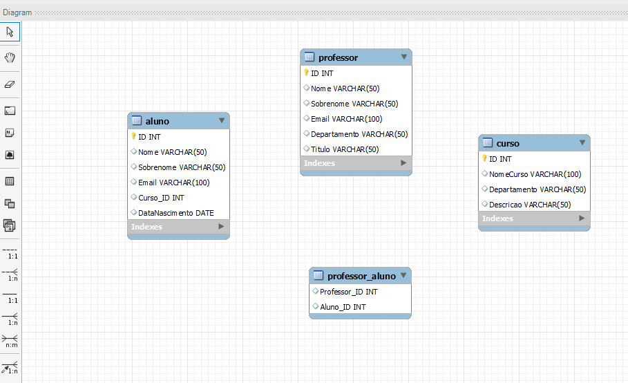

# Esquema de Banco de Dados - Exercício

## Tabelas

### Tabela Aluno
- Armazena informações de alunos.
- Campos: RA_ALU (Chave Primária), Nome, Sobrenome, Email, IdCurso, DtNascimento.

### Tabela Curso
- Armazena informações sobre cursos.
- Campos: ID (Chave Primária), Nome, Área, Desc.

### Tabela Professor
- Registra informações sobre professores.
- Campos: RA_PROF (Chave Primária), Nome, Sobrenome, Email, Curso.

### Tabela de Relação Professor_Aluno
- Permite relacionar professores e alunos em um relacionamento muitos-para-muitos.

## Trigger e Stored Procedure

### Trigger GerarEmailUnico
- Gera emails únicos para alunos com base em nome e sobrenome.

### Stored Procedure InserirCurso
- Insere novos cursos na tabela Curso com ID, Nome, Área e Descrição.

## Exemplo de Inserção de Dados

Exemplos de inserção de dados nas tabelas Aluno, Curso e Professor estão disponíveis no código SQL no repositório.
